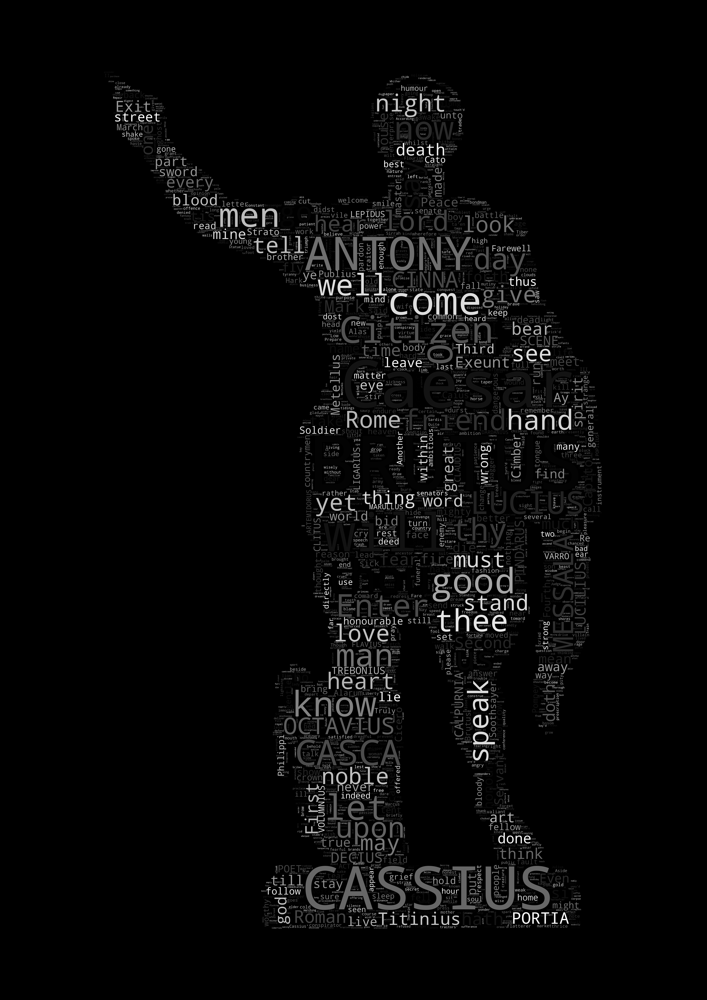

# word-cloud-from-text
### Simple script to generate word cloud from text file

  

This is a simple script to generate word cloud from text file. It can be used to analyze the frequency of words in a text file and visualize it in a word cloud.

## Requirments
* [Python 3.8+](https://www.python.org/downloads/)
* [WordCloud](https://pypi.org/project/wordcloud/)
* [Matplotlib](https://pypi.org/project/matplotlib/)
* [Pillow](https://pypi.org/project/Pillow/)
* [Numpy](https://pypi.org/project/numpy/)

## Setup
1. Clone the repository. (`git clone https://github.com/SuhJae/word-cloud-from-text.git`)
2. Edit the `text.txt` file to any text you want to analyze.
3. Change the mask.png file to any image you want to use as a mask. Image must be in png format and black and white. (Black parts will be filled with words.)
3. Run the `wordcloud.py` file.
4. The word cloud will be saved as `wordcloud.png` file.
5. Enjoy!
